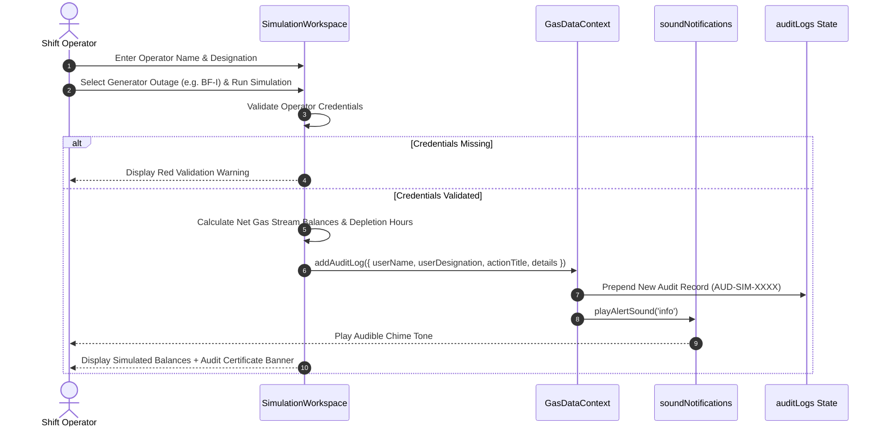

# 🏗️ SYSTEM ARCHITECTURE — GASMIND AI

## 1. High-Level Architecture Diagram

```mermaid
graph TD
    A[Browser Client / User Interface] --> B[App Component Layout]
    B --> C[Header Bar Component]
    B --> D[Sidebar Navigation Drawer]
    B --> E[View Router & Main Container]
    
    E --> F[Overview Dashboard]
    E --> G[Gas Generation View]
    E --> H[Gas Consumption View]
    E --> I[Gas Balance View]
    E --> J[Gas Network Sankey SVG]
    E --> K[Simulation Workspace]
    E --> L[Scenario Analysis Engine]
    E --> M[Operational Alerts Console]
    E --> N[Reports & Exports Generator]
    E --> O[Event Timeline Register]
    E --> P[Departmental Audit Trail]

    subgraph Core System Services
        Q[GasDataContext Central State Engine]
        R[Web Audio API Sound Notifications]
        S[Telemetry Live Pulse Simulation Engine]
        T[Report & Audit Export Engine (html2canvas / jsPDF / CSV)]
    end

    B <--> Q
    E <--> Q
    Q --> R
    Q --> S
    Q --> T
```

---

## 2. Component Hierarchy & Layering

### 2.1 Presentation Layer (`/src/views` & `/src/components`)
- **`App.tsx`**: Top-level layout container managing mobile drawer visibility (`mobileOpen`), sidebar collapse state (`isCollapsed`), and main view routing.
- **`Header.tsx`**: Contains the command palette global search bar (`⌘K`), sound mute toggle, live telemetry pulse switch, quick export button, and alerts drop-down menu.
- **`Sidebar.tsx`**: Left navigation drawer supporting collapsed mode (`68px`) and expanded mode (`280px`), highlighting active routes with LED badges.

### 2.2 Application State Layer (`/src/context/GasDataContext.tsx`)
- Centralized React Context (`GasDataContext`) serving as the Single Source of Truth for:
  - `gasMetrics`: Array of `GasTypeMetrics` (BF Gas, CO Gas, LD Gas, Natural Gas).
  - `nodes` & `pipelines`: Network graph vertices and edges for Sankey & Topology diagrams.
  - `alerts`: List of `AlertItem` alarms with severity levels and acknowledgment states.
  - `auditLogs`: Array of `AuditItem` records tracking simulation executions and report exports.
  - `simParams`: Parameters for contingency sandbox modeling.
  - `isLive`: Boolean flag toggling real-time telemetry pulse generation.

### 2.3 Audio Synthesis Subsystem (`/src/utils/soundNotifications.ts`)
- Utilizes browser-native **HTML5 Web Audio API** (`AudioContext`, `OscillatorNode`, `GainNode`).
- **Gesture Unlocker**: Listens for window `click`, `keydown`, or `touchstart` to unlock suspended audio contexts across mobile and desktop browsers automatically.
- **Tone Patterns**:
  - `playCriticalAlert()`: 3-step ascending alarm on `sawtooth` wave (880Hz → 1046Hz → 1318Hz, volume 0.45).
  - `playWarningAlert()`: Dual tone on `triangle` wave (659Hz → 523Hz, volume 0.40).
  - `playInfoAlert()`: Soft chime on `sine` wave (784Hz, volume 0.35).
  - `playSuccessSound()`: Dual ascending chime (523Hz → 784Hz, volume 0.35).

---

## 3. Data Flow Sequence Diagrams

### 3.1 Simulation Execution & Mandatory Audit Logging Sequence



---

## 4. Export & Report Generation Subsystem

1. **PDF Export**:
   - Uses `html2canvas` to render document DOM nodes into HTML5 Canvas bitmaps.
   - Compresses canvas bitmaps into a structured multipage PDF using `jspdf`.
2. **CSV Export**:
   - Assembles comma-separated text content with standard headers.
   - Wraps CSV strings into `Blob([csvContent], { type: 'text/csv;charset=utf-8;' })`.
   - Triggers browser file download using `URL.createObjectURL` and anchor click injection.
