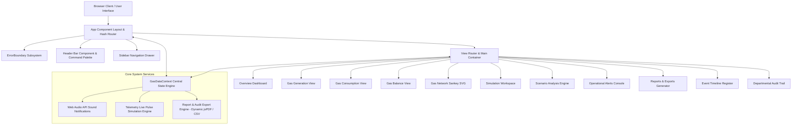
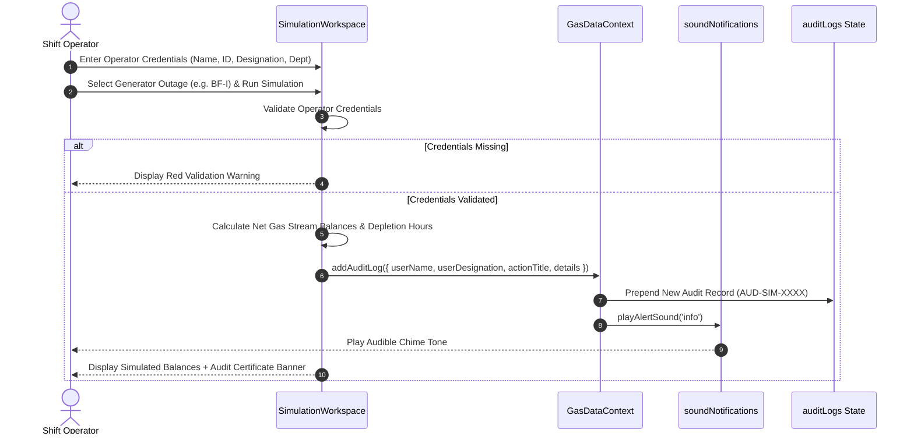

# 🏗️ SYSTEM ARCHITECTURE — GASMIND AI

## 1. High-Level Architecture Diagram

---

## 2. Component Hierarchy & Layering

### 2.1 Presentation Layer (`/src/views` & `/src/components`)
- **`App.tsx`**: Top-level layout container managing mobile drawer visibility (`mobileOpen`), sidebar collapse state (`isCollapsed`), hash-based URL routing, and `ErrorBoundary` wrapping.
- **`Header.tsx`**: Contains the command palette global search bar (`⌘K`), sound mute toggle, live telemetry pulse switch, quick export button, and accessible alerts drop-down menu.
- **`Sidebar.tsx`**: Left navigation drawer supporting collapsed mode (`68px`) and expanded mode (`280px`), highlighting active routes with LED badges.
- **`ErrorBoundary.tsx`**: React class component catching rendering errors and displaying an industrial dark recovery banner without crashing the entire display.

### 2.2 Application State Layer (`/src/context/GasDataContext.tsx`)
- Centralized React Context (`GasDataContext`) serving as the Single Source of Truth for:
  - `gasMetrics`: Array of `GasTypeMetrics` (BF Gas, CO Gas, LD Gas). Baseline generation: 2,010,000 Nm³/h; Baseline consumption: 1,870,000 Nm³/h.
  - `nodes`: Network graph vertices for Sankey topology diagram.
  - `alerts`: List of `AlertItem` alarms with severity levels (`critical`, `warning`, `info`) and acknowledgment states.
  - `auditLogs`: Array of `AuditItem` records tracking simulation executions and report exports with mandatory operator credentials.
  - `isLive`: Boolean flag toggling real-time telemetry pulse generation.

### 2.3 Audio Synthesis Subsystem (`/src/utils/soundNotifications.ts`)
- Utilizes browser-native **HTML5 Web Audio API** (`AudioContext`, `OscillatorNode`, `GainNode`).
- **Gesture Unlocker**: Listens for window `click`, `keydown`, or `touchstart` to unlock suspended audio contexts across mobile and desktop browsers automatically.
- **Tone Patterns**:
  - `playCriticalAlert()`: 3-step ascending alarm on `sawtooth` wave (880Hz → 1046Hz → 1318Hz, volume 0.45).
  - `playWarningAlert()`: Dual tone on `triangle` wave (659Hz → 523Hz, volume 0.40).
  - `playInfoAlert()`: Soft chime on `sine` wave (784Hz, volume 0.35).
  - `playSuccessSound()`: Dual ascending chime (523Hz → 784Hz, volume 0.35).

---

## 3. Data Flow Sequence Diagrams

### 3.1 Simulation Execution & Mandatory Audit Logging Sequence

---

## 4. Export & Report Generation Subsystem

1. **Dynamic PDF Export**:
   - Dynamic async import (`await import('jspdf')`, `await import('jspdf-autotable')`) defers ~380 KB of PDF libraries until report generation is invoked.
   - Generates structured multipage vector PDF documents with custom header metadata, operator credentials, telemetry tables, and page numbering.
2. **CSV Export**:
   - Assembles comma-separated text content with standard headers and CSV injection sanitization.
   - Wraps CSV strings into `Blob([csvContent], { type: 'text/csv;charset=utf-8;' })`.
   - Triggers browser file download using `URL.createObjectURL` and `URL.revokeObjectURL` cleanup.
